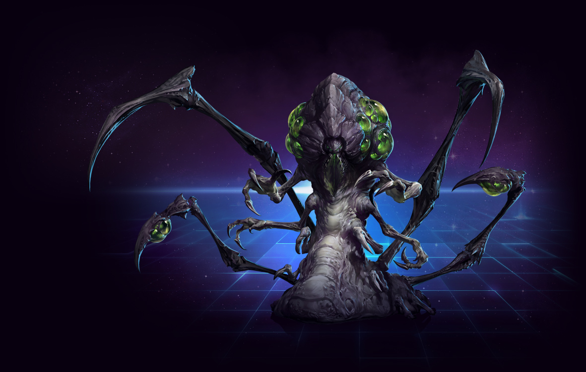
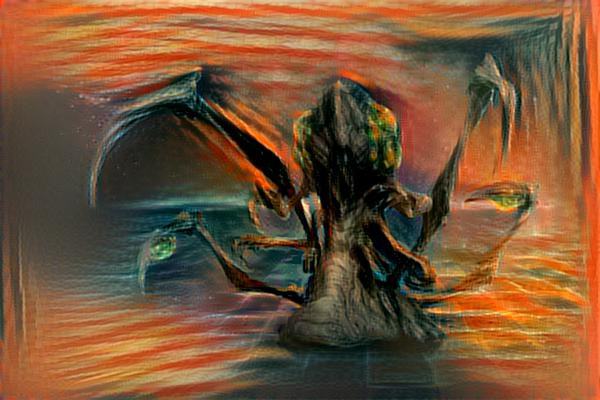
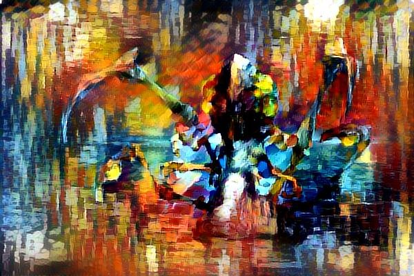
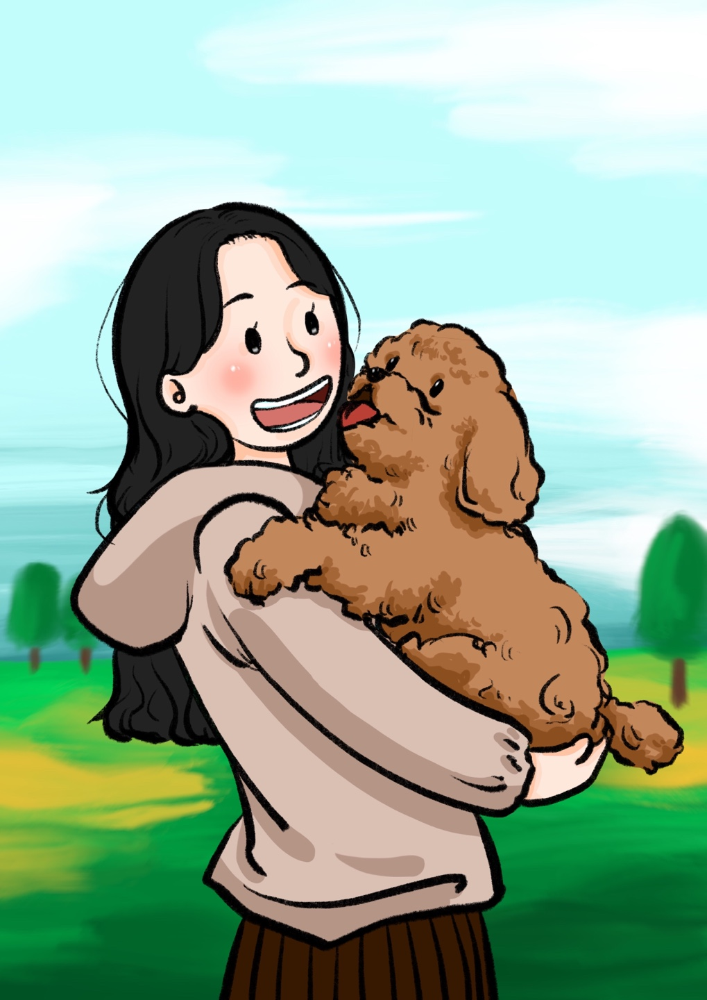
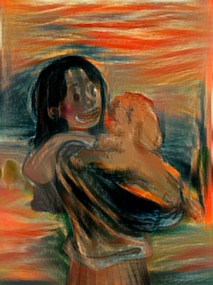
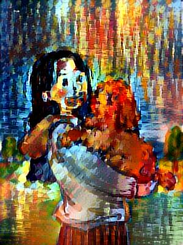
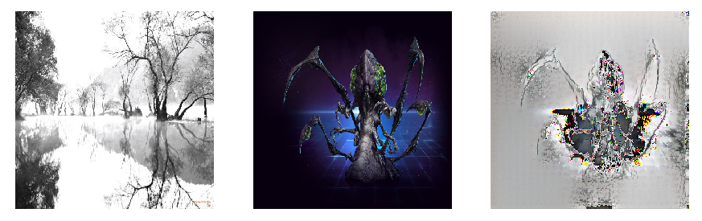

# Style Transfer

An implementaion of Style Transfer in Tensorflow

## requirements
* python version : 3.5.6
* tensorflow version : 1.10.0

## Examples(output)

## Styles

## Discussion

### Old version

* old version은 content image 사이즈와 style image 사이즈가 같아야지만 모델이 작동하고 content loss와 style loss에 사용되는 layer(i.e. conv1_1, conv2_1, etc.)의 수를 임의로 조정 할 수 없는 문제가 있었고 output image에 noise가 심하였다. 또한, Tensorflow를 이용한 논문 구현의 첫 시도였기에 코드의 readability가 매우 떨어진다.

* recenet version은 위의 문제점을 해결하기 위해 다시 짠 코드로 [이곳]을 참고하였다. content loss에 사용된 layer가 relu4_1인 경우 conv4_1인 경우 보다output image에서 content 원본의 특징이(색 팔레트, 윤곽등) 더 많이 나타났다.
* content_loss, style_loss, noise_loss(output image denoising을 위한 loss)각각의 wieght(i.e. hyper parameter)를 잘 조정해야 기대되는 output image를 얻을 수 있다.

#### Extra discussion
* 메모리가 충분한 GPU가 여러개 꼽혀있으면 모델을 돌리기 좋다. (GPU 사고싶다)
