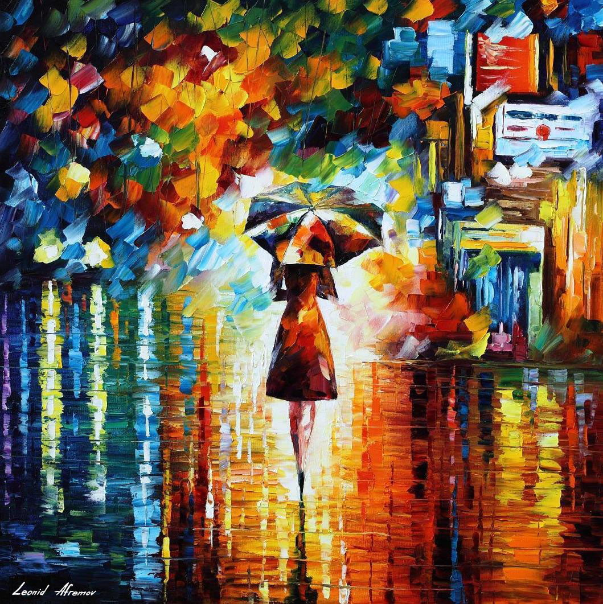

# Style Transfer

An implementaion of Style Transfer in Tensorflow

## requirements
* python version : 3.5.6
* tensorflow version : 1.10.0
* pre-trained vgg19 : [Download][vgg_w]

### How to use pre-trained vgg19
``` python
from six.moves import cPickle
vgg_w = cPickle.load(open('./vgg19_weights.pkl', 'rb'))
vgg_mean = np.array([123.68, 116.779, 103.939], dtype=np.float32)
```

vgg_w is a dictionary of tuples(size 2), first elements is an weight, second is a bias.

## Examples(output)


## Styles




## Discussion

### Old version


* In the case of old version, content_image_size and style_image_size are must be same to run the model. And there is a problem that the model can not use arbitrary number of layers used for content loss(i.e. conv1_1, conv2_1) and style loss vice versa(old version use only 2 layers for each loss). And there was severe noise in the output image. Also, since it was the first attempt to implement a paper using Tensorflow, the readability of the code is very poor.

* The recent version was coded to solve above problems. I referred [here][refer_post]. 

* When the layer used for the content loss was relu4_1, the characteristics of the original content (color palette, outline, etc.) appeared more in the output image than in the case of conv4_1.

* I referred [Wikipedia][denoise] for denosing algorithm.


## Reference

[A Neural Algorithm of Artistic Style][paper1]


[paper1]: https://arxiv.org/pdf/1508.06576v2.pdf
[refer_post]: https://medium.com/machine-learning-algorithms/image-style-transfer-740d08f8c1bd
[denoise]: https://en.wikipedia.org/wiki/Total_variation_denoising

[vgg_w]: https://drive.google.com/file/d/1JqZyGVQNcT-gmvTXHJVOoT9rUVoGa3_-/view?usp=sharing

#### Extra discussion
* If you have multiple GPUs with enough memory, it's good to run the model. (want some gpu...)
